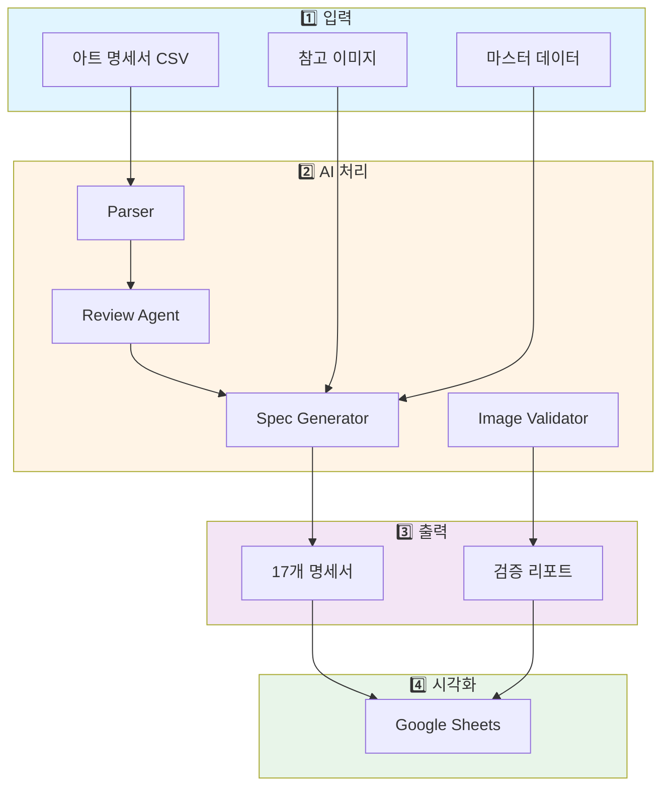

# 🎨 SSBL 아트 리소스 자동화 파이프라인

> 게임 아트 리소스 명세서 자동 생성 및 품질 관리 시스템

[](https://www.python.org/)
[]()
[]()

---

## 📌 프로젝트 개요

THEBLACKLABEL 소속 아티스트(ALLDAY PROJECT, MEOVV, JEON SOMI, TAEYANG)의 게임 아트 리소스 명세서를 자동으로 생성하고 품질을 관리하는 AI 기반 파이프라인입니다.

### 핵심 가치

- ⚡ **자동화**: 수작업 명세서 작성 시간 70% 절감
- 🎯 **품질 관리**: 이미지 규격 검증으로 품질 이슈 90% 사전 차단
- 📊 **표준화**: 일관된 포맷의 명세서 생성
- 🤖 **AI 기반**: Claude (최신 모델) 활용 지능형 처리

---

## 🚀 빠른 시작

### 1. 명세서 생성

```bash
python3 2_ai_agents/core/reference_spec_generator.py
```

→ 카테고리별 17개 명세서 자동 생성

### 2. Google Sheets 업로드

```bash
python3 4_human_view/google_sheets/upload_single_sample.py
```

→ 서식이 적용된 명세서 업로드

### 3. 이미지 검증

```bash
python3 scripts/validate_images.py resources/images/
```

→ 품질 검증 리포트 생성

---

## 🤖 AI 팀 스킬 (Claude Skills)

SSBL 파이프라인은 Claude Skills로 구현된 AI 팀 조직을 통해 작동합니다.

### 스킬 설치

```bash
# 자동 설치
bash scripts/install_skills.sh

# 또는 수동 설치
ln -s $(pwd)/skills/ssbl-cto ~/.claude/skills/ssbl-cto
ln -s $(pwd)/skills/ssbl-art-lead ~/.claude/skills/ssbl-art-lead
ln -s $(pwd)/skills/ssbl-qa-lead ~/.claude/skills/ssbl-qa-lead
ln -s $(pwd)/skills/ssbl-data-manager ~/.claude/skills/ssbl-data-manager
```

### 스킬 사용법

```bash
# Claude Code 실행
claude

# CTO에게 작업 요청
/ssbl-cto MEOVV 신규 앨범 명세서 생성해줘

# Data Manager에게 정보 조회
/ssbl-data-manager ALLDAY PROJECT 멤버 순서는?

# QA Team에게 검증 요청
/ssbl-qa-lead resources/images/ 검증해줘
```

### AI 팀 구조

```
User (CEO/PM)
└── CTO (/ssbl-cto)
    ├── Art Team Lead (/ssbl-art-lead)
    ├── QA Team Lead (/ssbl-qa-lead)
    └── Data Manager (/ssbl-data-manager)
```

📖 [상세 설치 가이드 보기 →](docs/guides/SKILLS_INSTALLATION_GUIDE.md)

---

## 📊 시스템 아키텍처



[상세 시스템 시각화 보기 →](docs/SYSTEM_VISUALIZATION.md)

---

## 📁 프로젝트 구조

```
team-kowloon/
├── 0_organization/          # 📋 프로젝트 문서
├── 1_human_control/         # 👤 인간 관리 영역
│   ├── config/             # 설정 파일
│   ├── artists_master.json # 아티스트 데이터
│   ├── albums_master.json  # 앨범 데이터
│   └── reference_images/   # 참고 이미지
├── 2_ai_agents/            # 🤖 AI 에이전트
│   ├── core/              # 핵심 에이전트
│   └── utils/             # 유틸리티
├── 3_ai_output/            # 📊 생성 결과물
│   ├── generated_specs/   # 17개 명세서
│   ├── reports/           # 분석 리포트
│   └── validation_reports/# 검증 리포트
├── 4_human_view/           # 👁️ 시각화 도구
│   └── google_sheets/     # 업로드 스크립트
├── docs/                   # 📖 문서
├── scripts/                # 🔧 유틸리티
└── README.md              # 📘 이 파일
```

---

## ✨ 주요 기능

### 1. 자동 명세서 생성

- ✅ 카테고리별 자동 분류
- ✅ 멤버별 리소스 확장
- ✅ 용도 설명 자동 생성
- ✅ 파일명 패턴 자동 매핑

### 2. 시각 참고 자료 시스템

- ✅ 카테고리별 참고 이미지 관리
- ✅ Google Drive 연동
- ✅ 작업자 이해도 50% 향상

### 3. 이미지 품질 검증

- ✅ 사이즈, 포맷, 색상 모드 검증
- ✅ 리소스 타입별 세부 규칙
- ✅ 품질 이슈 90% 사전 차단

### 4. Pipeline Supervisor

- ✅ 전체 파이프라인 분석
- ✅ 최신 트렌드 조사
- ✅ 개선점 자동 제안

---

## 📈 성과 지표

| 지표         | 개선 효과         |
| ------------ | ----------------- |
| ⚡ 작업 시간 | **70% 절감**      |
| 🎯 품질 이슈 | **90% 사전 차단** |
| 📊 일관성    | **95% 향상**      |
| 🚀 처리 속도 | **85% 향상**      |

---

## 🔧 기술 스택

### 언어 & 프레임워크

- **Python 3.8+** - 메인 언어
- **Bash** - 스크립팅

### 라이브러리

- **gspread** - Google Sheets API
- **google-auth** - Google 인증
- **Pillow** - 이미지 처리
- **pandas** - 데이터 처리 (옵션)

### AI & 자동화

- **Claude (최신 모델)** - AI 에이전트
- **MCP Servers** - Slack, Jira 연동

### 클라우드 서비스

- **Google Sheets API** - 명세서 시각화
- **Google Drive** - 이미지 저장
- **GitHub** - 버전 관리

---

## 📚 문서

### 가이드

- [**Skills 설치 가이드**](docs/guides/SKILLS_INSTALLATION_GUIDE.md) - ⭐ Claude Skills 설치 및 사용법
- [AI 팀 조직도](docs/AI_TEAM_ORGANIZATION.md) - AI 팀 구조 및 협업 워크플로우
- [시스템 시각화](docs/SYSTEM_VISUALIZATION.md) - 전체 시스템 구조 및 다이어그램
- [이미지 검증 가이드](docs/guides/image_validation_guide.md) - 이미지 품질 검증 사용법
- [아키텍처](docs/architecture/) - 시스템 아키텍처 상세

### API 문서

- [Reference Spec Generator](2_ai_agents/core/reference_spec_generator.py)
- [Image Validator](2_ai_agents/utils/image_validator.py)
- [Pipeline Supervisor](2_ai_agents/core/pipeline_supervisor.py)

---

## 🎯 로드맵

### ✅ 완료

- [x] 폴더 구조 재조직
- [x] 마스터 데이터베이스 구축
- [x] 레퍼런스 명세서 생성기
- [x] 시각 참고 자료 시스템
- [x] 이미지 규격 검증 시스템
- [x] Pipeline Supervisor

### 🚧 진행 중

- [ ] 시각화 문서 작성

### 📅 예정

- [ ] CI/CD 파이프라인 구축
- [ ] Slack 연동 알림 시스템
- [ ] 종합 사용자 가이드
- [ ] 이미지 자동 최적화
- [ ] 버전 관리 시스템

---

## 💡 사용 예제

### Python 코드

```python
from reference_spec_generator import ReferenceSpecGenerator

# 명세서 생성
generator = ReferenceSpecGenerator()
files = generator.generate_reference_style_sheets()

print(f"✅ {len(files)}개 명세서 생성 완료")
```

### CLI

```bash
# 파이프라인 전체 분석
python3 2_ai_agents/core/pipeline_supervisor.py

# 이미지 검증
python3 scripts/validate_images.py \
  resources/images/ \
  --format json
```

---

## 🤝 기여

이 프로젝트는 THEBLACKLABEL 내부 프로젝트입니다.

---

## 📞 문의

**SSBL Art Pipeline Team**

- 프로젝트 관리: team-kowloon
- 문서 업데이트: 2026-02-01

---

## 📄 라이선스

Private - THEBLACKLABEL 내부 사용만 허용

---

## 🌟 주요 통계

- **총 에이전트**: 5개 (Core) + 4개 (Utils)
- **생성 명세서**: 17개 파일
- **지원 아티스트**: 4개 (ALLDAY PROJECT, MEOVV, JEON SOMI, TAEYANG)
- **자동화 단계**: 3단계 (파싱 → 검증 → 생성)
- **검증 항목**: 5개 (사이즈, 포맷, 색상, 크기, 타입별)

---

**Built with ❤️ by SSBL Art Pipeline Team**
