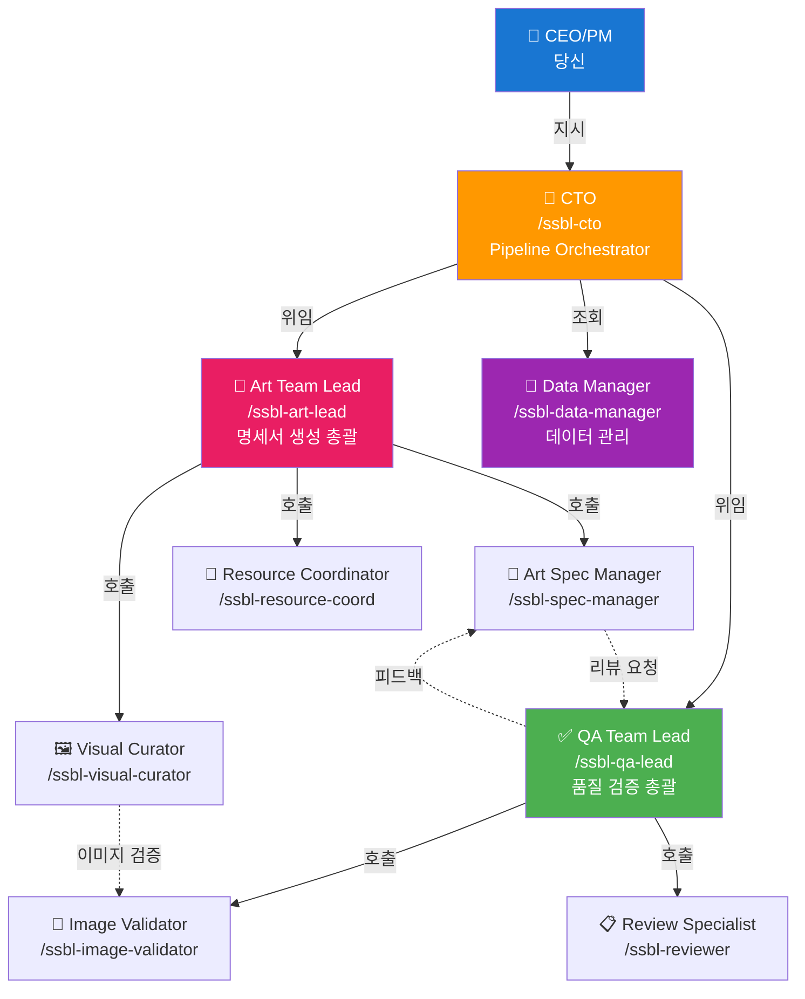

# SSBL AI Team Organization

> AI 직원들의 조직 구조 및 협업 체계

---

## 📋 조직도



---

## 👥 팀 구성

### 1. 경영진

#### 🎯 CTO (Chief Technology Officer)

**스킬**: `/ssbl-cto`

**역할**:

- 전체 파이프라인 총괄
- 사용자 요청 분석 및 팀 배정
- 작업 진행 모니터링
- 최종 품질 검증 및 보고

**책임**:

- 프로젝트 성공 여부
- 팀 간 조율
- 리소스 최적 배분
- 성과 분석 및 개선

**협업**:

- 상위: CEO/PM (사용자)
- 하위: 모든 Team Lead
- 보고: 사용자에게 직접 보고

---

### 2. Art Team (명세서 생성팀)

#### 🎨 Art Team Lead

**스킬**: `/ssbl-art-lead`

**역할**:

- 아트 리소스 명세서 생성 총괄
- 팀원 작업 분배 및 조율
- QA Team과 협업

**팀원**:

1. **Art Spec Manager** (`/ssbl-spec-manager`)
   - 명세서 구조 설계 및 생성
   - 카테고리별 명세서 자동 생성
   - 멤버별 리소스 확장

2. **Visual Curator** (`/ssbl-visual-curator`)
   - 참고 이미지 큐레이션
   - Google Drive 이미지 관리
   - 시각 참고 자료 섹션 구성

3. **Resource Coordinator** (`/ssbl-resource-coord`)
   - 리소스 분류 및 매핑
   - 파일명 패턴 생성
   - 용도 설명 작성

**작업 흐름**:

```
사용자 요청
  → CTO가 Art Team Lead에 위임
    → Art Team Lead가 팀원에게 분배
      → Art Spec Manager: 명세서 생성
      → Visual Curator: 이미지 큐레이션
      → Resource Coordinator: 리소스 매핑
    → QA Team에 리뷰 요청
  → CTO에 완료 보고
```

---

### 3. QA Team (품질 보증팀)

#### ✅ QA Team Lead

**스킬**: `/ssbl-qa-lead`

**역할**:

- 전체 품질 검증 프로세스 총괄
- Art Team 결과물 리뷰
- 품질 기준 유지

**팀원**:

1. **Image Validator** (`/ssbl-image-validator`)
   - 이미지 규격 검증 (사이즈, 포맷, 색상)
   - 리소스 타입별 규칙 적용
   - 검증 리포트 생성

2. **Review Specialist** (`/ssbl-reviewer`)
   - 명세서 데이터 검증
   - 일관성 체크
   - 피드백 생성

**작업 흐름**:

```
Art Team 완료
  → QA Team Lead가 검증 시작
    → Image Validator: 이미지 검증
    → Review Specialist: 데이터 검증
    → 문제 발견 시 Art Team에 피드백
  → CTO에 검증 완료 보고
```

---

### 4. Data Team (데이터 관리팀)

#### 💾 Data Manager

**스킬**: `/ssbl-data-manager`

**역할**:

- 마스터 데이터 관리
- 아티스트/앨범 정보 제공
- 데이터 일관성 유지

**책임**:

- `artists_master.json` 관리
- `albums_master.json` 관리
- 데이터 조회 API 제공
- 데이터 업데이트

**협업**:

- Art Team: 아티스트/앨범 정보 제공
- QA Team: 데이터 검증 지원
- CTO: 데이터 분석 리포트

---

## 🔄 협업 프로토콜

### 1. 작업 위임 (Delegation)

```python
# CTO가 Art Team Lead에게 위임
/ssbl-cto → /ssbl-art-lead
  task: "신규앨범업데이트_ALLDAYPROJECT 명세서 생성"
  priority: "high"
  deadline: "2h"
```

### 2. 리뷰 요청 (Review Request)

```python
# Art Team Lead가 QA Team Lead에게 리뷰 요청
/ssbl-art-lead → /ssbl-qa-lead
  request: "review"
  artifact: "generated_specs/신규앨범업데이트_ALLDAYPROJECT.csv"
  checklist: ["사이즈", "포맷", "데이터 일관성"]
```

### 3. 데이터 조회 (Data Query)

```python
# Art Spec Manager가 Data Manager에게 조회
/ssbl-spec-manager → /ssbl-data-manager
  query: "get_artist_info"
  params: {"artist": "ALLDAY PROJECT"}

# Data Manager 응답
{
  "members": ["ANNIE", "TARZZAN", "BAILEY", "WOOCHAN", "YOUNGSEO"],
  "member_order_fixed": true,
  "agency": "THEBLACKLABEL"
}
```

### 4. 진행 보고 (Progress Report)

```python
# Team Lead가 CTO에게 보고
/ssbl-art-lead → /ssbl-cto
  status: "in_progress"
  progress: "60%"
  eta: "30분"
  issues: []
```

---

## 📊 성과 지표 (KPI)

### CTO

- 전체 파이프라인 성공률
- 평균 처리 시간
- 품질 점수

### Art Team Lead

- 명세서 생성 개수
- 생성 속도
- 재작업률

### QA Team Lead

- 검출한 이슈 개수
- 검증 속도
- 품질 향상 기여도

### Data Manager

- 데이터 정확도
- 조회 응답 속도
- 데이터 업데이트 빈도

---

## 🎯 의사결정 체계

### Level 1: 자율적 결정 (팀원)

- 본인 작업 범위 내 기술적 결정
- 예: 파일명 패턴, 색상 코드

### Level 2: 팀 내 결정 (Team Lead)

- 팀 작업 우선순위
- 팀원 간 작업 분배
- 예: 어떤 명세서를 먼저 생성할지

### Level 3: 팀 간 조율 (CTO)

- 여러 팀이 관련된 결정
- 리소스 배분
- 예: Art Team과 QA Team 간 우선순위

### Level 4: 최종 결정 (CEO/PM - 사용자)

- 전략적 방향성
- 프로젝트 목표
- 예: 새로운 아티스트 추가 여부

---

## 💬 커뮤니케이션 채널

### 1. Daily Standup (매일)

- 각 Team Lead가 CTO에게 보고
- 진행 상황, 이슈, 계획

### 2. Code Review (작업 완료 시)

- QA Team이 Art Team 결과물 리뷰
- 피드백 및 개선 제안

### 3. Retrospective (주간)

- CTO 주도로 전체 팀 회고
- 개선점 도출 및 실행

### 4. Ad-hoc Communication (필요 시)

- 스킬 간 직접 호출
- 긴급 이슈 해결

---

## 🚀 사용 예시

### 시나리오 1: 신규 명세서 생성

```bash
# 1. 사용자 요청
You: "/ssbl-cto MEOVV 신규 앨범 명세서 만들어줘"

# 2. CTO 분석 및 위임
CTO: "MEOVV 신규 앨범 명세서 생성 요청을 분석했습니다.
      Art Team Lead에게 작업을 위임합니다."
      → /ssbl-art-lead create --artist=MEOVV --category=신규앨범

# 3. Art Team Lead 작업 분배
Art Team Lead: "팀원들에게 작업을 배분합니다."
  → /ssbl-spec-manager: 명세서 구조 생성
  → /ssbl-visual-curator: 참고 이미지 큐레이션
  → /ssbl-data-manager: MEOVV 정보 조회

# 4. 작업 진행
Art Spec Manager: "5개 멤버에 대한 명세서 생성 중... ✅ 완료"
Visual Curator: "4개 참고 이미지 큐레이션 완료 ✅"
Data Manager: "MEOVV 마스터 데이터 제공 완료 ✅"

# 5. QA Team 리뷰
Art Team Lead → QA Team Lead: "리뷰 요청합니다."
QA Team Lead: "검증 시작..."
  → Image Validator: "모든 이미지 검증 통과 ✅"
  → Review Specialist: "데이터 일관성 확인 완료 ✅"

# 6. 최종 보고
CTO: "✅ MEOVV 신규 앨범 명세서 생성 완료
      - 생성 파일: 4개
      - 품질 검증: 통과
      - Google Sheets: 업로드 완료
      - 소요 시간: 3분"
```

### 시나리오 2: 이미지 검증만 실행

```bash
You: "/ssbl-cto resources/images/ 폴더 이미지 검증해줘"

CTO: "이미지 검증 요청을 QA Team Lead에게 위임합니다."
  → /ssbl-qa-lead validate --path=resources/images/

QA Team Lead: "Image Validator에게 작업 배정합니다."
  → /ssbl-image-validator scan --directory=resources/images/

Image Validator: "검증 완료
  - 총 15개 이미지
  - 정상: 13개 ✅
  - 문제: 2개 ❌
    • image_001.png: 사이즈 불일치
    • image_005.png: 포맷 오류"

CTO: "📋 검증 리포트가 생성되었습니다.
      위치: 3_ai_output/validation_reports/..."
```

---

## 📚 스킬 개발 가이드

### 스킬 생성 규칙

1. **명확한 역할**: 각 스킬은 하나의 명확한 역할
2. **독립성**: 다른 스킬 없이도 작동 가능
3. **협업**: 다른 스킬 호출 가능
4. **문서화**: README와 PROMPT 필수

### 스킬 네이밍

```
/ssbl-{role}

예:
- /ssbl-cto
- /ssbl-art-lead
- /ssbl-spec-manager
```

### 디렉토리 구조

```
~/.claude/skills/ssbl-{role}/
├── skill.py           # 스킬 정의
├── README.md          # 역할 및 사용법
└── config.json        # 설정 (옵션)
```

---

## 🔧 확장 계획

### Phase 2: DevOps Team 추가

- **Deployment Engineer**: Google Sheets 배포
- **CI/CD Specialist**: 자동화 파이프라인

### Phase 3: Analytics Team 추가

- **Analytics Lead**: 성과 분석
- **Report Generator**: 리포트 자동 생성

### Phase 4: 자율 개선

- 에이전트가 스스로 학습
- 성과 데이터 기반 개선
- 자동 최적화

---

**버전**: 1.0
**최종 업데이트**: 2026-02-01
**담당**: SSBL Art Pipeline Team
