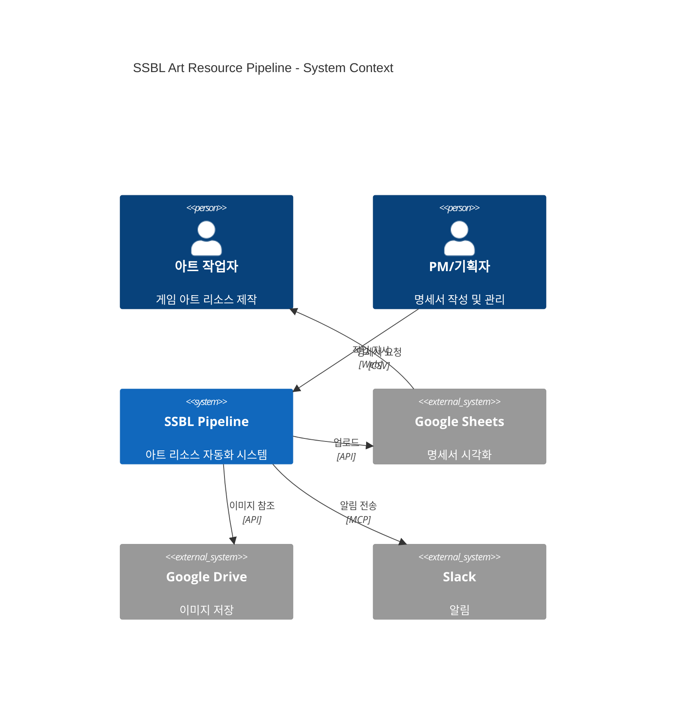
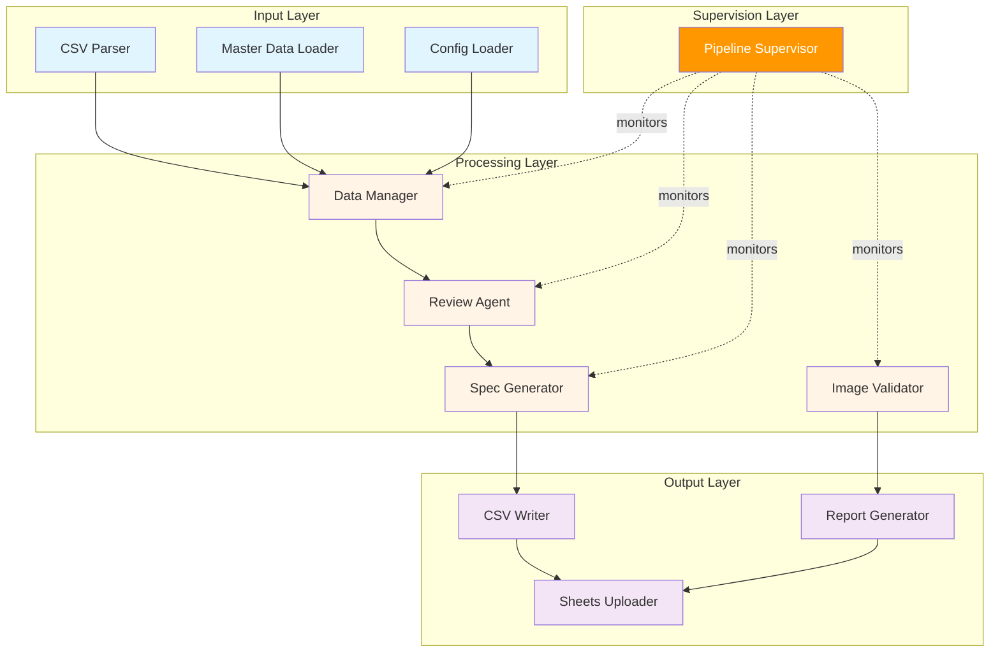
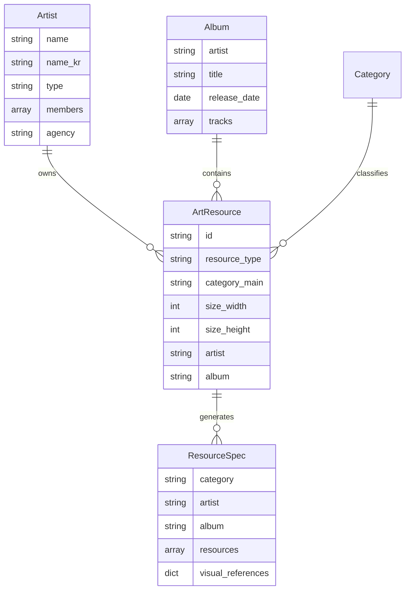
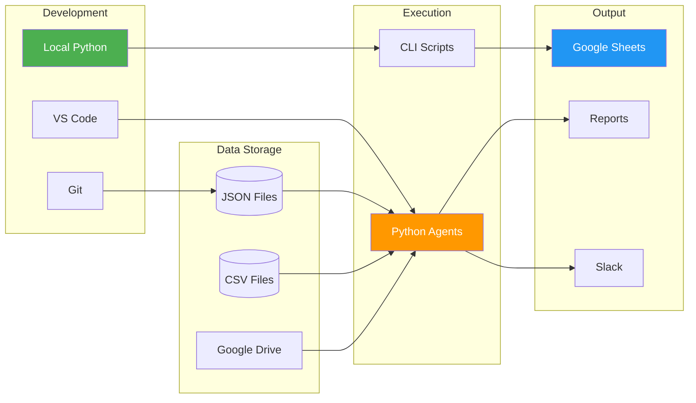
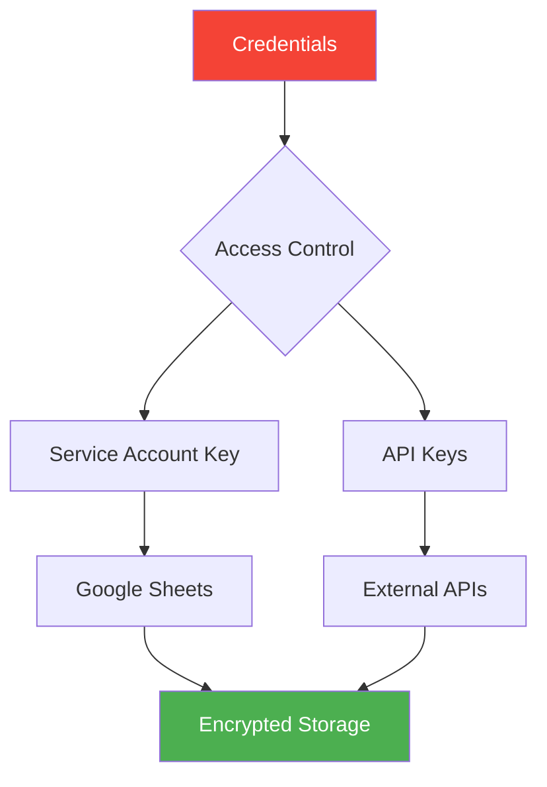

# 시스템 아키텍처

## 전체 구조

## 컴포넌트 구조

## 데이터 모델

## 배포 구조

---

## 주요 설계 원칙

### 1. 관심사의 분리 (Separation of Concerns)

- **Input Layer**: 데이터 수집 및 파싱
- **Processing Layer**: 비즈니스 로직
- **Output Layer**: 결과 생성
- **Supervision Layer**: 모니터링 및 개선

### 2. 단일 책임 원칙 (Single Responsibility)

- 각 에이전트는 하나의 명확한 역할
- 재사용 가능한 유틸리티 모듈

### 3. 의존성 주입 (Dependency Injection)

- Manager 클래스를 통한 데이터 접근
- 설정 파일 기반 유연한 구성

### 4. 확장성 (Extensibility)

- 새로운 아티스트/앨범 추가 용이
- 플러그인 형태의 검증 규칙

---

## 보안 고려사항

### 보안 조치

- ✅ Service Account Key를 `.gitignore`에 포함
- ✅ 환경 변수로 민감 정보 관리
- ✅ 최소 권한 원칙 적용
- ⚠️ 공유 링크는 제한된 접근만 허용

---

**마지막 업데이트**: 2026-02-01
