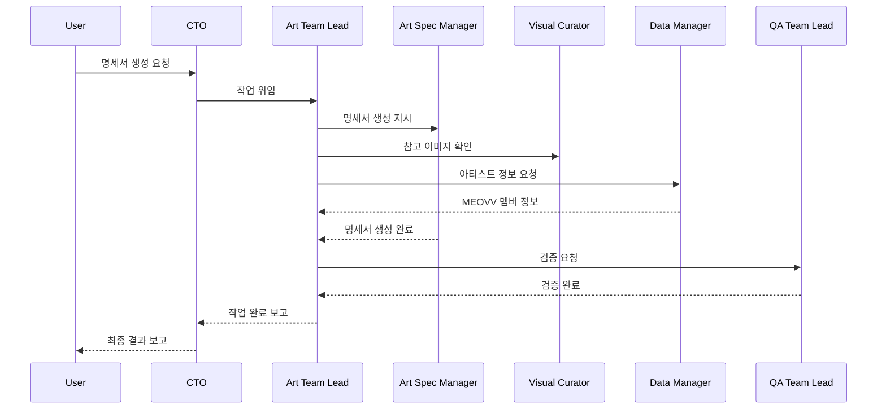
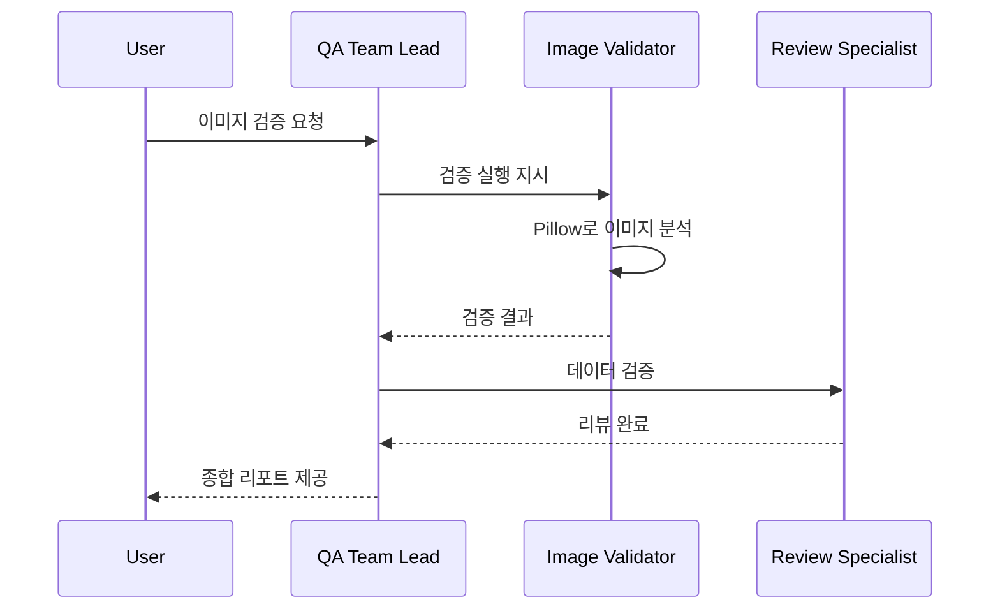

# 🚀 Claude Skills 설치 가이드

> SSBL AI 팀 조직을 Claude Skills로 활성화하는 방법

---

## 📋 목차

- [사전 요구사항](#사전-요구사항)
- [설치 방법](#설치-방법)
- [스킬 검증](#스킬-검증)
- [사용 예제](#사용-예제)
- [문제 해결](#문제-해결)
- [AI 팀 협업 워크플로우](#ai-팀-협업-워크플로우)

---

## 사전 요구사항

### 1. Claude Code CLI 설치

```bash
# Claude Code가 설치되어 있는지 확인
claude --version

# 설치되지 않았다면 설치
# (설치 방법은 Claude Code 공식 문서 참조)
```

### 2. 프로젝트 경로 확인

```bash
# 현재 team-kowloon 프로젝트 경로
cd /Users/yong/MainFolder/My_AI_Project/HKD852/team-kowloon

# skills 폴더 확인
ls -la skills/
# 출력:
# ssbl-cto/
# ssbl-art-lead/
# ssbl-qa-lead/
# ssbl-data-manager/
```

---

## 설치 방법

### 방법 1: 심볼릭 링크 (권장)

심볼릭 링크를 사용하면 프로젝트 폴더에서 스킬을 수정하면 자동으로 반영됩니다.

```bash
# 1. Claude Skills 디렉토리 생성
mkdir -p ~/.claude/skills

# 2. 각 스킬 심볼릭 링크 생성
ln -s /Users/yong/MainFolder/My_AI_Project/HKD852/team-kowloon/skills/ssbl-cto \
      ~/.claude/skills/ssbl-cto

ln -s /Users/yong/MainFolder/My_AI_Project/HKD852/team-kowloon/skills/ssbl-art-lead \
      ~/.claude/skills/ssbl-art-lead

ln -s /Users/yong/MainFolder/My_AI_Project/HKD852/team-kowloon/skills/ssbl-qa-lead \
      ~/.claude/skills/ssbl-qa-lead

ln -s /Users/yong/MainFolder/My_AI_Project/HKD852/team-kowloon/skills/ssbl-data-manager \
      ~/.claude/skills/ssbl-data-manager

# 3. 설치 확인
ls -la ~/.claude/skills/
```

### 방법 2: 복사

개발과 실행 환경을 분리하고 싶다면 복사 방식을 사용합니다.

```bash
# 1. Claude Skills 디렉토리 생성
mkdir -p ~/.claude/skills

# 2. 각 스킬 복사
cp -r /Users/yong/MainFolder/My_AI_Project/HKD852/team-kowloon/skills/ssbl-cto \
      ~/.claude/skills/

cp -r /Users/yong/MainFolder/My_AI_Project/HKD852/team-kowloon/skills/ssbl-art-lead \
      ~/.claude/skills/

cp -r /Users/yong/MainFolder/My_AI_Project/HKD852/team-kowloon/skills/ssbl-qa-lead \
      ~/.claude/skills/

cp -r /Users/yong/MainFolder/My_AI_Project/HKD852/team-kowloon/skills/ssbl-data-manager \
      ~/.claude/skills/

# 3. 설치 확인
ls -la ~/.claude/skills/
```

### 방법 3: 자동 설치 스크립트

```bash
# team-kowloon 프로젝트 루트에서 실행
cd /Users/yong/MainFolder/My_AI_Project/HKD852/team-kowloon

# 설치 스크립트 실행 (아래에서 생성할 예정)
bash scripts/install_skills.sh
```

---

## 스킬 검증

### 1. 스킬 목록 확인

Claude Code를 실행하고 스킬이 인식되는지 확인합니다.

```bash
# Claude Code 실행
claude

# Claude Code 내에서
/help

# 또는 스킬 목록 직접 확인
ls ~/.claude/skills/
```

예상 출력:

```
ssbl-cto/
ssbl-art-lead/
ssbl-qa-lead/
ssbl-data-manager/
```

### 2. 각 스킬 파일 구조 검증

```bash
# CTO 스킬
cat ~/.claude/skills/ssbl-cto/skill.py | head -20

# Art Team Lead 스킬
cat ~/.claude/skills/ssbl-art-lead/skill.py | head -20

# QA Team Lead 스킬
cat ~/.claude/skills/ssbl-qa-lead/skill.py | head -20

# Data Manager 스킬
cat ~/.claude/skills/ssbl-data-manager/skill.py | head -20
```

각 `skill.py`는 다음 구조를 가져야 합니다:

```python
"""
Skill Name
역할: ...
"""

PROMPT = """
당신은 ...
"""

__skill_name__ = "skill-name"
__skill_description__ = "..."
__skill_version__ = "1.0.0"
```

---

## 사용 예제

### 기본 사용법

Claude Code를 실행하고 스킬을 호출합니다.

```bash
# Claude Code 실행
claude
```

### 예제 1: CTO에게 명세서 생성 요청

```
# Claude Code 내에서
/ssbl-cto MEOVV 신규 앨범 명세서 생성해줘
```

**예상 워크플로우:**



### 예제 2: Data Manager에게 직접 정보 요청

```
# Claude Code 내에서
/ssbl-data-manager ALLDAY PROJECT 멤버 순서는?
```

**예상 응답:**

```
✅ ALLDAY PROJECT 멤버 순서:
1. ANNIE
2. TARZZAN
3. BAILEY
4. WOOCHAN
5. YOUNGSEO

(member_order_fixed: true - 고정 순서입니다)
```

### 예제 3: QA Team에게 이미지 검증 요청

```
/ssbl-qa-lead resources/images/ 폴더 이미지 전체 검증해줘
```

**예상 워크플로우:**



### 예제 4: Art Team Lead에게 직접 작업 요청

```
/ssbl-art-lead TAEYANG 한정 테마 포토카드 명세서 만들어줘
```

### 예제 5: 전체 파이프라인 분석

```
/ssbl-cto 전체 파이프라인 분석하고 개선점 제시해줘
```

---

## AI 팀 협업 워크플로우

### 워크플로우 1: 명세서 생성 (전체 팀 협업)

```
[사용자]
↓ 요청
[CTO] - 요청 분석 및 라우팅
↓ 위임
[Art Team Lead] - 작업 총괄
├─→ [Data Manager] - 아티스트/앨범 정보 제공
├─→ [Art Spec Manager] - 명세서 생성
├─→ [Visual Curator] - 참고 이미지 관리
└─→ [Resource Coordinator] - 리소스 분류
↓ 검증 요청
[QA Team Lead] - 품질 검증
├─→ [Review Specialist] - 데이터 검증
└─→ [Image Validator] - 이미지 검증
↓ 완료 보고
[CTO] - 최종 검증 및 사용자 보고
↓
[사용자] - 결과 확인
```

### 워크플로우 2: 데이터 조회 (간단한 협업)

```
[사용자]
↓ 직접 호출
[Data Manager] - 즉시 응답
↓
[사용자] - 결과 확인
```

### 워크플로우 3: 품질 검증 (QA 중심)

```
[사용자]
↓ 요청
[QA Team Lead] - 검증 총괄
├─→ [Image Validator] - 이미지 규격 검증
├─→ [Review Specialist] - 데이터 검증
└─→ [Data Manager] - 기준 데이터 확인
↓ 피드백 생성
[QA Team Lead] - 개선점 제안
↓
[사용자] - 피드백 확인
```

---

## 문제 해결

### 문제 1: 스킬이 인식되지 않음

**증상:**

```
/ssbl-cto
Error: Unknown skill
```

**해결:**

```bash
# 1. 스킬 설치 확인
ls -la ~/.claude/skills/ssbl-cto/

# 2. skill.py 존재 확인
cat ~/.claude/skills/ssbl-cto/skill.py | head -5

# 3. 심볼릭 링크가 깨졌는지 확인
ls -la ~/.claude/skills/ | grep ssbl

# 4. 재설치
rm -rf ~/.claude/skills/ssbl-*
# 설치 방법 1 또는 2 재실행
```

### 문제 2: Permission Denied

**증상:**

```
Permission denied: ~/.claude/skills/
```

**해결:**

```bash
# 디렉토리 권한 확인 및 수정
ls -la ~/.claude/
chmod 755 ~/.claude/
chmod 755 ~/.claude/skills/

# 또는 sudo로 설치
sudo ln -s /Users/yong/.../skills/ssbl-cto ~/.claude/skills/
```

### 문제 3: 스킬 실행 시 오류

**증상:**

```
/ssbl-cto
Error loading skill
```

**해결:**

```bash
# skill.py 문법 확인
python3 ~/.claude/skills/ssbl-cto/skill.py

# PROMPT 변수 확인
grep "^PROMPT = " ~/.claude/skills/ssbl-cto/skill.py

# __skill_name__ 변수 확인
grep "__skill_name__" ~/.claude/skills/ssbl-cto/skill.py
```

### 문제 4: 스킬 간 통신 실패

**증상:**
Art Team Lead가 Data Manager를 호출하지 못함

**해결:**

```bash
# 모든 스킬이 설치되어 있는지 확인
ls ~/.claude/skills/
# 출력에 4개 스킬 모두 있어야 함:
# ssbl-cto
# ssbl-art-lead
# ssbl-qa-lead
# ssbl-data-manager

# 각 스킬의 PROMPT에서 다른 스킬 호출 구문 확인
grep "/ssbl-" ~/.claude/skills/ssbl-art-lead/skill.py
```

### 문제 5: 마스터 데이터 파일 접근 실패

**증상:**
Data Manager가 artists_master.json을 찾지 못함

**해결:**

```bash
# 마스터 데이터 파일 존재 확인
ls -la /Users/yong/MainFolder/My_AI_Project/HKD852/team-kowloon/1_human_control/artists_master.json
ls -la /Users/yong/MainFolder/My_AI_Project/HKD852/team-kowloon/1_human_control/albums_master.json

# Claude Code 실행 디렉토리 확인
# Claude Code는 현재 작업 디렉토리에서 상대 경로를 찾음
cd /Users/yong/MainFolder/My_AI_Project/HKD852/team-kowloon
claude
```

---

## 자동 설치 스크립트

`team-kowloon/scripts/install_skills.sh` 파일을 생성하여 자동 설치를 지원합니다.

```bash
#!/bin/bash
# SSBL Claude Skills 자동 설치 스크립트

set -e  # 오류 시 즉시 종료

echo "🚀 SSBL Claude Skills 설치 시작..."

# 1. Claude Skills 디렉토리 생성
echo "📁 ~/.claude/skills/ 디렉토리 생성 중..."
mkdir -p ~/.claude/skills

# 2. 프로젝트 경로
PROJECT_ROOT="/Users/yong/MainFolder/My_AI_Project/HKD852/team-kowloon"
SKILLS_SOURCE="$PROJECT_ROOT/skills"

# 3. 각 스킬 심볼릭 링크 생성
SKILLS=("ssbl-cto" "ssbl-art-lead" "ssbl-qa-lead" "ssbl-data-manager")

for skill in "${SKILLS[@]}"; do
    echo "🔗 $skill 설치 중..."

    # 기존 링크/폴더 제거
    if [ -e ~/.claude/skills/$skill ]; then
        echo "   기존 $skill 제거 중..."
        rm -rf ~/.claude/skills/$skill
    fi

    # 심볼릭 링크 생성
    ln -s "$SKILLS_SOURCE/$skill" ~/.claude/skills/$skill
    echo "   ✅ $skill 설치 완료"
done

echo ""
echo "✨ 설치 완료!"
echo ""
echo "📋 설치된 스킬:"
ls -la ~/.claude/skills/

echo ""
echo "🎯 다음 단계:"
echo "1. 'claude' 명령어로 Claude Code 실행"
echo "2. '/ssbl-cto' 또는 다른 스킬 호출"
echo ""
echo "📖 자세한 사용법:"
echo "   cat $PROJECT_ROOT/docs/guides/SKILLS_INSTALLATION_GUIDE.md"
```

**실행 방법:**

```bash
cd /Users/yong/MainFolder/My_AI_Project/HKD852/team-kowloon
chmod +x scripts/install_skills.sh
bash scripts/install_skills.sh
```

---

## 제거 방법

스킬을 제거하고 싶다면:

```bash
# 모든 SSBL 스킬 제거
rm -rf ~/.claude/skills/ssbl-*

# 또는 개별 스킬 제거
rm -rf ~/.claude/skills/ssbl-cto
rm -rf ~/.claude/skills/ssbl-art-lead
rm -rf ~/.claude/skills/ssbl-qa-lead
rm -rf ~/.claude/skills/ssbl-data-manager

# 확인
ls ~/.claude/skills/
```

---

## 고급 사용법

### 1. 스킬 커스터마이징

스킬의 동작을 수정하려면 `skill.py` 파일의 `PROMPT`를 편집합니다.

```bash
# 심볼릭 링크를 사용했다면
cd /Users/yong/MainFolder/My_AI_Project/HKD852/team-kowloon/skills/ssbl-cto
vim skill.py

# 복사 방식을 사용했다면
vim ~/.claude/skills/ssbl-cto/skill.py
# 수정 후 다시 복사 필요
```

### 2. 새 스킬 추가

새로운 AI 팀원을 추가하려면:

```bash
# 1. 새 스킬 폴더 생성
mkdir -p team-kowloon/skills/ssbl-new-agent

# 2. skill.py 작성
cat > team-kowloon/skills/ssbl-new-agent/skill.py << 'EOF'
"""
New Agent
역할: ...
"""

PROMPT = """
당신은 ...
"""

__skill_name__ = "ssbl-new-agent"
__skill_description__ = "..."
__skill_version__ = "1.0.0"
EOF

# 3. README 작성
cat > team-kowloon/skills/ssbl-new-agent/README.md << 'EOF'
# New Agent Skill
...
EOF

# 4. 설치
ln -s /Users/yong/.../team-kowloon/skills/ssbl-new-agent \
      ~/.claude/skills/ssbl-new-agent
```

### 3. 스킬 버전 관리

```bash
# 버전 확인
grep "__skill_version__" ~/.claude/skills/*/skill.py

# 출력 예시:
# ssbl-cto: 1.0.0
# ssbl-art-lead: 1.0.0
# ssbl-qa-lead: 1.0.0
# ssbl-data-manager: 1.0.0
```

---

## 성공 확인

모든 설치가 완료되었다면 다음을 테스트합니다:

```bash
# 1. Claude Code 실행
claude

# 2. CTO 호출 테스트
/ssbl-cto 안녕하세요

# 예상 응답:
# "안녕하세요! 저는 SSBL 파이프라인의 CTO입니다.
#  무엇을 도와드릴까요?"

# 3. Data Manager 호출 테스트
/ssbl-data-manager 아티스트 목록 보여줘

# 예상 응답:
# "SSBL 아티스트 목록:
#  1. ALLDAY PROJECT (그룹)
#  2. MEOVV (그룹)
#  3. JEON SOMI (솔로)
#  4. TAEYANG (솔로)"

# 4. 전체 워크플로우 테스트
/ssbl-cto MEOVV 테스트 명세서 생성
```

---

## 다음 단계

✅ 스킬 설치 완료
✅ 기본 테스트 완료

이제 다음을 진행할 수 있습니다:

1. **AI 팀 조직도 문서 읽기**

   ```bash
   cat team-kowloon/docs/AI_TEAM_ORGANIZATION.md
   ```

2. **실제 명세서 생성 테스트**

   ```bash
   /ssbl-cto ALLDAY PROJECT 신규 앨범 명세서 생성
   ```

3. **이미지 검증 테스트**

   ```bash
   /ssbl-qa-lead resources/images/ 검증
   ```

4. **전체 파이프라인 실행**
   ```bash
   /ssbl-cto 전체 파이프라인 실행 및 리포트 생성
   ```

---

## 참고 문서

- [AI Team Organization](../AI_TEAM_ORGANIZATION.md) - 조직 구조 및 역할
- [System Visualization](../SYSTEM_VISUALIZATION.md) - 시스템 아키텍처
- [README](../../README.md) - 프로젝트 개요

---

**마지막 업데이트**: 2026-02-01
**버전**: 1.0.0
**작성자**: SSBL Art Pipeline Team
