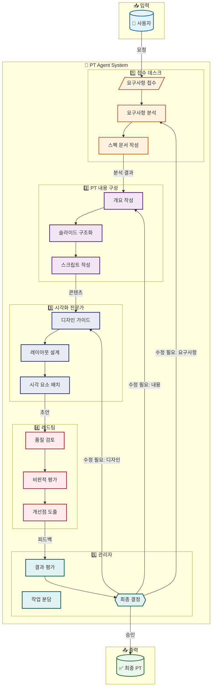
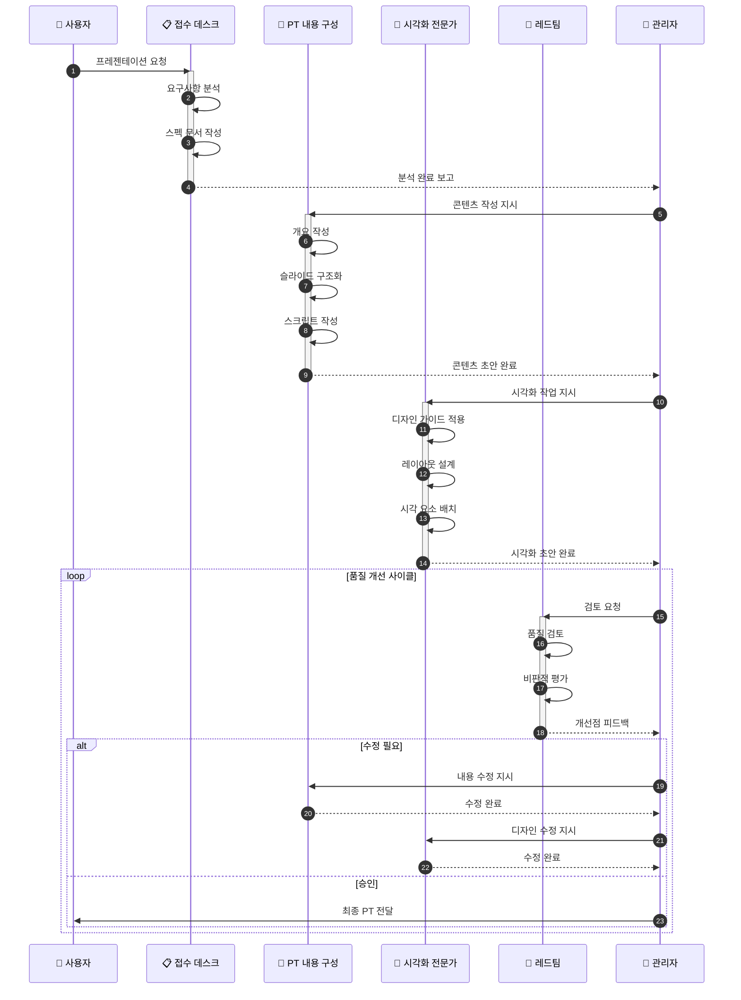
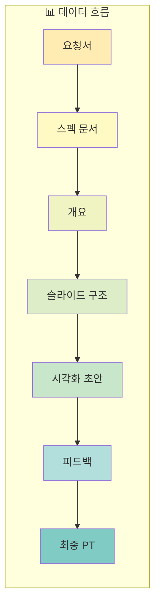
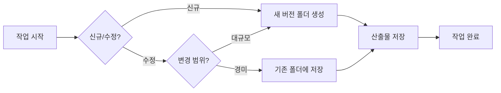

# PT Agent 파이프라인 아키텍처

## 시스템 개요

PT Agent는 프레젠테이션 제작을 자동화하는 멀티 에이전트 시스템입니다.
5개의 전문 에이전트가 협업하여 고품질의 프레젠테이션을 제작합니다.

> **Industry References**:
> - AI Agent Orchestration Patterns (Azure, AWS, LangGraph)
> - Maker-Checker Pattern
> - Sequential + Parallel Orchestration

---

## 🔄 오케스트레이션 패턴

### 적용 패턴: Coordinator + Specialists

```
╔════════════════════════════════════════════════════════════════╗
║  2025 Multi-Agent Best Practices                               ║
║                                                                ║
║  "72% of enterprise AI projects now involve multi-agent        ║
║   architectures, up from 23% in 2024"                          ║
║                                                                ║
║  핵심 원칙:                                                     ║
║  1. 단일 에이전트로 시작 → 필요시 확장                          ║
║  2. 가벼운 커뮤니케이션 (필요한 정보만 공유)                     ║
║  3. State Machine으로 결정론적 동작 보장                        ║
║  4. 명시적 상태, 전환, 재시도, 타임아웃 정의                     ║
╚════════════════════════════════════════════════════════════════╝
```

### 실행 모드

| 모드 | 설명 | 적용 상황 |
|-----|------|----------|
| **Sequential** | A → B → C 순차 실행 | 의존성 있는 작업 |
| **Parallel** | A + B 동시 실행 | 독립적 작업 |
| **Maker-Checker** | 제작 ↔ 검토 반복 | 품질 개선 사이클 |

### 에러 복구 전략

```yaml
에러_복구:
  재시도: "실패 시 최대 2회 재시도"
  대체_경로: "시각화 실패 → 콘텐츠에서 텍스트 버전 생성"
  그레이스풀_저하: "일부 기능 없이 진행 가능하면 진행"
  인간_개입: "3회 실패 시 사용자 확인 요청"
```

---

## 파이프라인 다이어그램



## 상세 시퀀스 다이어그램



## 에이전트 역할 정의

| 에이전트 | 역할 | 주요 기능 |
|---------|------|----------|
| **접수 데스크** | 요구사항 분석가 | 요청 접수, 분석, 스펙 문서화 |
| **PT 내용 구성** | 콘텐츠 전략가 | 개요/구조/스크립트 작성 |
| **시각화 전문가** | 디자인 전문가 | 심플/깔끔 스타일 시각화 |
| **레드팀** | 품질 검토관 | 비판적 평가, 개선점 도출 |
| **관리자** | 프로젝트 매니저 | 작업 조율, 최종 승인 |

## 데이터 흐름



## 버전 관리 정책

### 출력물 폴더 구조

```
outputs/
├── v1_2026-02-03/          # 버전_날짜 형식
│   ├── slide_01_*.svg
│   ├── slide_02_*.svg
│   └── ...
├── v2_2026-02-04/
│   └── ...
└── latest -> v2_2026-02-04  # 심볼릭 링크 (선택)
```

### 버전 생성 규칙

| 상황 | 버전 처리 |
|-----|----------|
| **신규 PT 요청** | 새 버전 폴더 생성 (`v{N+1}_{날짜}`) |
| **기존 PT 수정** | 새 버전 폴더 생성 (기존 버전 보존) |
| **경미한 수정** | 동일 버전 내 덮어쓰기 가능 |

### 버전 네이밍 컨벤션

```
v{버전번호}_{YYYY-MM-DD}

예시:
- v1_2026-02-03  # 첫 번째 버전
- v2_2026-02-03  # 같은 날 두 번째 버전
- v3_2026-02-04  # 다음 날 세 번째 버전
```

### 워크플로우


