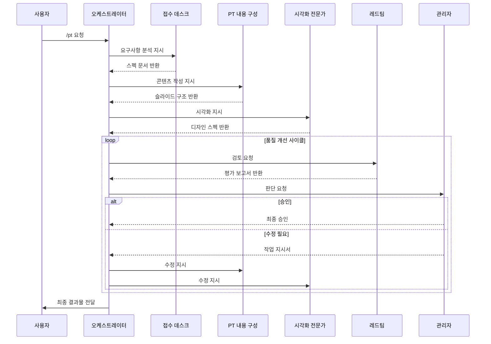

# PT Agent 오케스트레이터 (Orchestrator)

## 시스템 개요

PT Agent는 고품질 프레젠테이션을 자동으로 제작하는 멀티 에이전트 시스템입니다.
5개의 전문 에이전트가 파이프라인 형태로 협업하여 사용자의 요구사항을 분석하고,
콘텐츠를 구성하고, 시각화하고, 검토하여 최종 결과물을 생성합니다.

## 에이전트 구성

```
┌─────────────────────────────────────────────────────────────────┐
│                    PT Agent System                              │
├─────────────────────────────────────────────────────────────────┤
│                                                                 │
│  📋 접수 데스크      →  요구사항 접수 및 분석                      │
│  📝 PT 내용 구성     →  콘텐츠 구조화 및 스크립트                   │
│  🎨 시각화 전문가    →  심플/깔끔 스타일 시각화                     │
│  🔴 레드팀          →  비판적 평가 및 개선점 도출                   │
│  👔 관리자          →  작업 조율 및 최종 승인                       │
│                                                                 │
└─────────────────────────────────────────────────────────────────┘
```

## 실행 명령어

### 프레젠테이션 제작 요청
```
/pt [요청 내용]
```

### 개별 에이전트 호출
```
/pt-reception    → 접수 데스크만 실행
/pt-content      → PT 내용 구성만 실행
/pt-visual       → 시각화 전문가만 실행
/pt-redteam      → 레드팀 검토만 실행
/pt-manager      → 관리자 판단 요청
```

## 파이프라인 실행 흐름



## 작업 흐름 상세

### Phase 1: 요구사항 분석
```yaml
단계: 1
담당: 접수 데스크
입력: 사용자 요청
출력: 스펙 문서 (YAML)
검증:
  - 필수 정보 완비 여부
  - 명확성 확인
```

### Phase 2: 콘텐츠 구성
```yaml
단계: 2
담당: PT 내용 구성
입력: 스펙 문서
출력: 슬라이드 구조 문서
검증:
  - 구조 완성도
  - 메시지 명확성
```

### Phase 3: 시각화
```yaml
단계: 3
담당: 시각화 전문가
입력: 슬라이드 구조 문서
출력: 디자인 스펙
검증:
  - 디자인 일관성
  - 가독성
```

### Phase 4: 품질 검토
```yaml
단계: 4
담당: 레드팀
입력: 전체 결과물
출력: 평가 보고서
검증:
  - CRISP 평가 완료
  - 피드백 구체성
```

### Phase 5: 최종 결정
```yaml
단계: 5
담당: 관리자
입력: 평가 보고서
출력: 승인 또는 작업 지시서
검증:
  - 승인 기준 충족 여부
```

## 세션 상태 관리

```yaml
세션_상태:
  세션_ID: "[UUID]"
  시작_시간: "[YYYY-MM-DD HH:MM:SS]"
  현재_단계: "[Phase 번호]"
  라운드: "[수정 라운드]"

  문서_저장소:
    스펙_문서: "[경로 또는 내용]"
    슬라이드_구조: "[경로 또는 내용]"
    디자인_스펙: "[경로 또는 내용]"
    평가_보고서: "[경로 또는 내용]"

  진행_기록:
    - 시간: "[HH:MM:SS]"
      에이전트: "[에이전트명]"
      액션: "[수행한 작업]"
      결과: "[결과 요약]"
```

## 에러 핸들링

### 에러 유형별 처리

| 에러 유형 | 처리 방법 |
|---------|----------|
| 정보 부족 | 접수 데스크가 추가 질문 |
| 구조 실패 | PT 내용 구성 재실행 |
| 디자인 불일치 | 시각화 전문가 수정 |
| 무한 루프 | 3회 초과 시 사용자 알림 |

### 복구 메커니즘
```
1. 마지막 성공 상태로 롤백
2. 해당 단계 재실행
3. 3회 실패 시 사용자 개입 요청
```

## 사용 예시

### 기본 사용
```
User: /pt 다음 주 이사회에서 2024년 실적 발표를 해야 합니다.
      15분 정도이고, 매출 성장과 내년 전략을 중점적으로 다루고 싶습니다.

System: PT Agent를 시작합니다.

[접수 데스크] 요구사항을 분석합니다...
→ 스펙 문서 생성 완료

[PT 내용 구성] 콘텐츠를 구성합니다...
→ 12장의 슬라이드 구조 생성 완료

[시각화 전문가] 디자인을 적용합니다...
→ 디자인 스펙 생성 완료

[레드팀] 품질을 검토합니다...
→ 평가 점수: 78점 (C등급)
→ 개선 필요 사항 3건

[관리자] 수정을 지시합니다...
→ 작업 지시서 발행

[PT 내용 구성] 수정 중...
[시각화 전문가] 수정 중...

[레드팀] 재검토 중...
→ 평가 점수: 91점 (A등급)

[관리자] 최종 승인합니다.

✅ PT 제작이 완료되었습니다!
```

## 설정 옵션

```yaml
설정:
  최대_수정_라운드: 3
  자동_진행: true  # false시 각 단계마다 확인
  출력_형식: "markdown"  # markdown, pptx, html
  디자인_스타일: "minimal"  # minimal, corporate, creative
  언어: "ko"  # ko, en
```

## 출력 형식

### Markdown 출력 (기본)
각 슬라이드를 Markdown 형식으로 출력합니다.

### MARP 출력
Marp 형식의 Markdown으로 출력하여 바로 슬라이드로 변환할 수 있습니다.

### HTML 출력
Reveal.js 기반 HTML 슬라이드로 출력합니다.

## 파일 구조

```
PT_Agent/
├── skills/
│   ├── 00_orchestrator.md      # 이 문서
│   ├── 01_reception_desk.md    # 접수 데스크
│   ├── 02_content_architect.md # PT 내용 구성
│   ├── 03_visual_expert.md     # 시각화 전문가
│   ├── 04_red_team.md          # 레드팀
│   └── 05_manager.md           # 관리자
├── docs/
│   └── pipeline.md             # 파이프라인 다이어그램
├── templates/                   # 템플릿 저장소
└── outputs/                     # 출력물 저장소
```

## 에이전트 호출 규칙

오케스트레이터는 다음 규칙에 따라 에이전트를 호출합니다:

1. **순차 실행**: 기본적으로 접수→콘텐츠→시각화→레드팀→관리자 순서
2. **조건부 실행**: 관리자 지시에 따라 특정 에이전트만 재실행
3. **병렬 실행 금지**: 동시에 여러 에이전트 실행 불가
4. **상태 유지**: 각 에이전트의 출력물은 세션 내에서 유지

---

**시작하려면 `/pt [요청 내용]`을 입력하세요.**
