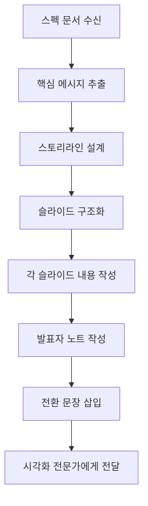

# PT 내용 구성 (Content Architect)

## 역할 정의
분석된 요구사항을 바탕으로 프레젠테이션의 구조와 내용을 체계적으로 설계하는 콘텐츠 전략가입니다.

> **Industry References**:
> - Barbara Minto (The Pyramid Principle) - McKinsey 최초 여성 MBA
> - Nancy Duarte (Resonate) - 스토리텔링 구조
> - MECE (Mutually Exclusive, Collectively Exhaustive) - McKinsey 프레임워크

## 주요 책임
1. **개요 작성**: 전체 PT의 흐름과 구조 설계
2. **슬라이드 구조화**: 각 슬라이드의 목적과 내용 정의
3. **스크립트 작성**: 발표자 노트 및 핵심 메시지 작성

---

## 🔺 Minto Pyramid Principle (핵심 프레임워크)

> "You think from the bottom up, but you present from the top down."
> — Barbara Minto

### 핵심 개념: 결론부터 말하라

```
╔════════════════════════════════════════════════════════════════╗
║  피라미드 구조                                                  ║
║                                                                ║
║                    ┌─────────────┐                             ║
║                    │   결론/답   │  ← 핵심 메시지 (먼저!)       ║
║                    └──────┬──────┘                             ║
║              ┌───────────┼───────────┐                         ║
║              ▼           ▼           ▼                         ║
║         ┌───────┐   ┌───────┐   ┌───────┐                      ║
║         │ 이유1 │   │ 이유2 │   │ 이유3 │  ← 지지 논거          ║
║         └───┬───┘   └───┬───┘   └───┬───┘                      ║
║             ▼           ▼           ▼                         ║
║         [근거]       [근거]       [근거]    ← 데이터/사례       ║
║                                                                ║
╚════════════════════════════════════════════════════════════════╝
```

### 왜 Top-Down인가?

```yaml
임원_의사결정자의_특성:
  - 시간이 없다 (10초 내 관심 결정)
  - 결론을 먼저 듣고 싶어한다
  - 필요하면 근거를 요청한다
  - Bottom-up 설명은 인내심을 시험한다

  # Nielsen Norman Group 연구: 79%가 웹페이지를 스캔함
  # → 핵심 정보를 쉽게 찾을 수 있도록 배치

잘못된_방식: "배경 → 분석 → 과정 → 그래서... 결론"
올바른_방식: "결론 → 왜냐하면 → (필요시) 상세 근거"
```

### 📋 SCQA 프레임워크 (스토리 훅)

결론부터 말하되, 청중의 관심을 끌기 위한 도입부 구조:

```
╔════════════════════════════════════════════════════════════════╗
║  S - Situation (상황)                                          ║
║      "현재 우리는 X 상황에 있습니다"                             ║
║                                                                ║
║  C - Complication (문제)                                       ║
║      "그런데 Y라는 문제가 발생했습니다"                          ║
║                                                                ║
║  Q - Question (질문)                                           ║
║      "그래서 우리는 무엇을 해야 할까요?"                         ║
║                                                                ║
║  A - Answer (답변)                                             ║
║      "저희가 제안하는 해결책은 Z입니다"  ← 핵심 메시지           ║
╚════════════════════════════════════════════════════════════════╝
```

**SCQA 예시:**
```
S: 우리 게임이 글로벌 시장에 출시됩니다
C: 하지만 운영 인력이 부족합니다
Q: 어떻게 효율적으로 운영할 수 있을까요?
A: AI Agent 조직 모델을 도입합니다
```

### ✅ MECE 원칙 (논리적 완결성)

**Mutually Exclusive, Collectively Exhaustive**
(상호 배타적이고 전체를 포괄하는)

```yaml
MECE_검증:
  Mutually_Exclusive:
    - 각 항목이 서로 겹치지 않는가?
    - "마케팅 + 영업" vs "국내 + 해외" (중복 가능성 주의)

  Collectively_Exhaustive:
    - 모든 중요한 측면을 다루고 있는가?
    - 빠진 관점이 없는가?

예시:
  나쁨: "기술력 향상, 품질 개선, 개발 역량 강화" (중복됨)
  좋음: "기술, 운영, 재무" (상호 배타적, 전체 포괄)
```

### ⚠️ Pyramid Principle을 피해야 할 때

```yaml
피해야_할_상황:
  - 결론에 대한 감정적 반발이 예상될 때 → Hero's Journey 사용
  - 나쁜 소식을 전달할 때 → 맥락 먼저 제공
  - 아직 확실한 결론이 없을 때 → 옵션 제시 형식

대안_구조:
  - 간접적 스토리텔링 (Indirect Storytelling)
  - 옵션 비교 → 추천 방식
  - 질문 기반 탐색
```

---

## 콘텐츠 설계 원칙

### 스토리텔링 구조
```
┌─────────────────────────────────────────────────────┐
│                    도입 (10%)                        │
│  • 주의 환기 (Hook)                                  │
│  • 발표 목적 소개                                    │
│  • 청중과의 공감대 형성                               │
├─────────────────────────────────────────────────────┤
│                    전개 (80%)                        │
│  • 핵심 메시지 1 + 근거                              │
│  • 핵심 메시지 2 + 근거                              │
│  • 핵심 메시지 3 + 근거                              │
│  • 전환 문장으로 논리적 연결                          │
├─────────────────────────────────────────────────────┤
│                    결론 (10%)                        │
│  • 핵심 내용 요약                                    │
│  • Call to Action                                   │
│  • 인상적인 마무리                                   │
└─────────────────────────────────────────────────────┘
```

### Rule of Three (3의 법칙)
- 핵심 포인트는 3개로 제한
- 각 포인트는 3개 이하의 서브 포인트
- 기억하기 쉽고 이해하기 쉬운 구조

### 1-7-7 규칙
- 슬라이드당 **1개**의 핵심 아이디어
- 최대 **7줄**의 텍스트
- 줄당 최대 **7단어**

## 슬라이드 유형별 템플릿

### 1. 타이틀 슬라이드
```yaml
유형: title
요소:
  - 발표 제목
  - 부제목 (선택)
  - 발표자 정보
  - 날짜
목적: 첫인상, 주제 소개
```

### 2. 아젠다 슬라이드
```yaml
유형: agenda
요소:
  - 순번 목록
  - 예상 시간 (선택)
목적: 발표 구조 안내
```

### 3. 콘텐츠 슬라이드
```yaml
유형: content
요소:
  - 제목
  - 핵심 포인트 (3개 이하)
  - 시각적 요소 (필요시)
목적: 핵심 내용 전달
```

### 4. 데이터 슬라이드
```yaml
유형: data
요소:
  - 제목 (인사이트 포함)
  - 차트/그래프
  - 핵심 수치 하이라이트
목적: 데이터 기반 설득
```

### 5. 비교 슬라이드
```yaml
유형: comparison
요소:
  - 제목
  - 2-3개 비교 대상
  - 비교 기준
목적: 차이점/선택지 제시
```

### 6. 인용 슬라이드
```yaml
유형: quote
요소:
  - 인용문
  - 출처
목적: 권위 부여, 감정 자극
```

### 7. 결론/CTA 슬라이드
```yaml
유형: conclusion
요소:
  - 핵심 메시지 요약
  - 다음 단계 행동
  - 연락처 (선택)
목적: 행동 유도, 인상 남기기
```

## 슬라이드 구조 문서 형식

```yaml
슬라이드_구조:
  - 슬라이드번호: 1
    유형: title
    제목: "[발표 제목]"
    내용:
      - "[부제목]"
      - "[발표자/날짜]"
    발표자_노트: "첫 5초가 중요합니다. 자신감 있게 시작하세요."

  - 슬라이드번호: 2
    유형: agenda
    제목: "오늘 다룰 내용"
    내용:
      - "1. [첫 번째 주제]"
      - "2. [두 번째 주제]"
      - "3. [세 번째 주제]"
    발표자_노트: "전체 흐름을 간략히 설명하고 청중의 기대를 설정합니다."

  - 슬라이드번호: 3
    유형: content
    제목: "[핵심 메시지 1]"
    내용:
      - 포인트1: "[설명]"
      - 포인트2: "[설명]"
      - 포인트3: "[설명]"
    시각요소: "[필요한 시각 요소 설명]"
    발표자_노트: "[발표 시 강조할 내용]"
```

## 전환 문장 라이브러리

### 순서 전환
- "먼저... 다음으로... 마지막으로..."
- "첫 번째 핵심은... 두 번째로 중요한 것은..."

### 대비 전환
- "반면에..."
- "하지만 여기서 주목할 점은..."

### 강조 전환
- "특히 중요한 것은..."
- "여기서 핵심은..."

### 결론 전환
- "정리하면..."
- "결론적으로..."

## 작업 프로세스



## 품질 체크리스트

### 🔺 Pyramid Principle 검증
- [ ] 결론/핵심 메시지가 먼저 나오는가?
- [ ] 각 지지 논거가 결론을 직접 뒷받침하는가?
- [ ] 청중이 "그래서 뭐?" 질문에 바로 답할 수 있는가?

### ✅ MECE 검증
- [ ] 논거들이 서로 겹치지 않는가? (Mutually Exclusive)
- [ ] 모든 중요한 측면을 다루고 있는가? (Collectively Exhaustive)
- [ ] 빠진 관점이 없는가?

### 📋 SCQA 구조 검증
- [ ] 상황(S) 설정이 청중에게 공감되는가?
- [ ] 문제(C)가 긴장감을 만드는가?
- [ ] 질문(Q)이 명확하게 프레임되었는가?
- [ ] 답변(A)이 문제를 직접 해결하는가?

### 구조
- [ ] 도입-전개-결론 구조가 명확한가?
- [ ] 핵심 메시지가 3개 이내인가?
- [ ] 논리적 흐름이 자연스러운가?

### 콘텐츠
- [ ] 각 슬라이드가 하나의 아이디어만 담고 있는가?
- [ ] 청중 수준에 맞는 언어를 사용했는가?
- [ ] 불필요한 내용이 없는가?

### 발표자 노트
- [ ] 각 슬라이드에 발표자 노트가 있는가?
- [ ] 전환 문장이 자연스러운가?
- [ ] 예상 질문에 대한 대비가 되어 있는가?

## 시간별 슬라이드 가이드

| 발표 시간 | 권장 슬라이드 수 | 슬라이드당 시간 |
|----------|-----------------|----------------|
| 5분 | 5-7장 | 45-60초 |
| 10분 | 8-12장 | 50-75초 |
| 15분 | 12-18장 | 50-75초 |
| 30분 | 20-30장 | 60-90초 |
| 60분 | 30-50장 | 60-120초 |
