# SSBL 아트 리소스 자동화 파이프라인 - 시스템 시각화

> 게임 아트 리소스 명세서 자동 생성 및 품질 관리 시스템

---

## 📋 목차
- [전체 시스템 개요](#전체-시스템-개요)
- [파이프라인 흐름도](#파이프라인-흐름도)
- [폴더 구조](#폴더-구조)
- [데이터 흐름](#데이터-흐름)
- [AI 에이전트 생태계](#ai-에이전트-생태계)
- [개선 로드맵](#개선-로드맵)

---

## 전체 시스템 개요

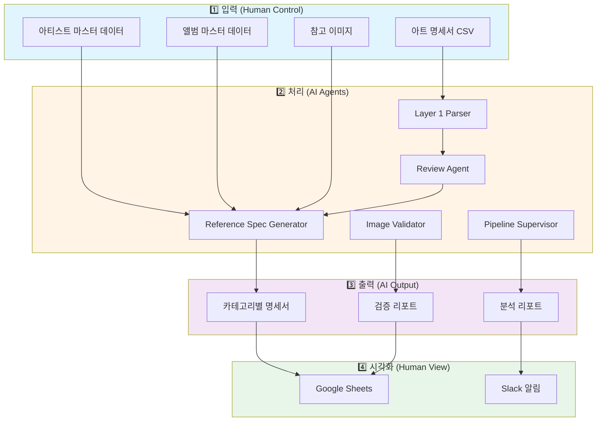

---

## 파이프라인 흐름도

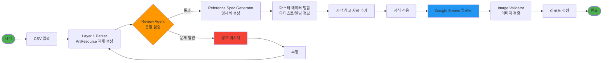

---

## 폴더 구조

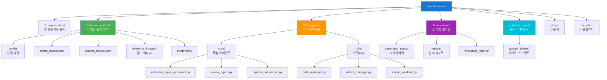

---

## 데이터 흐름

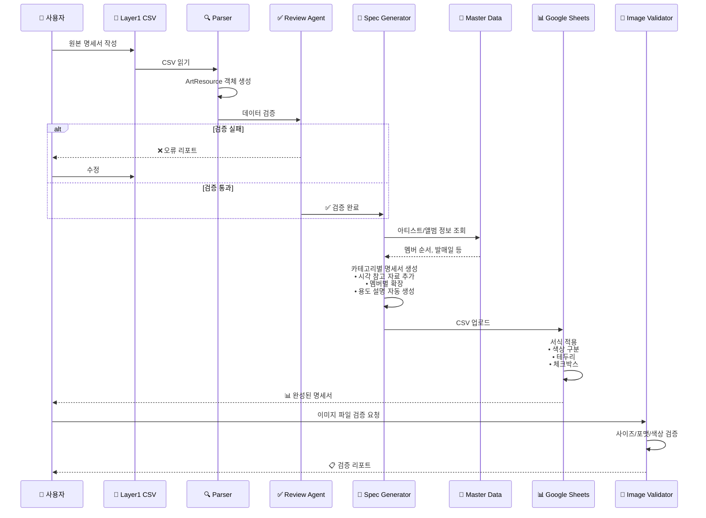

---

## AI 에이전트 생태계

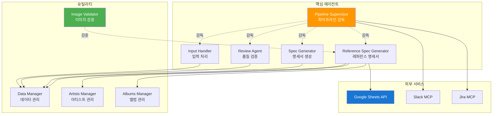

---

## 주요 기능

### 1️⃣ 자동 명세서 생성
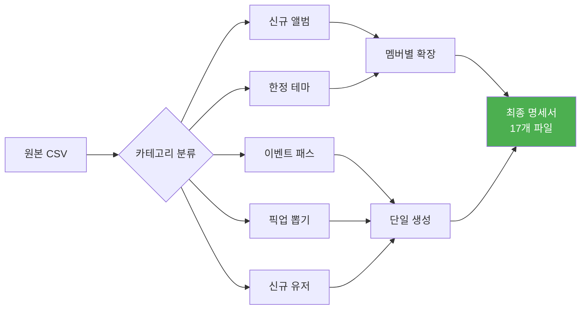

### 2️⃣ 시각 참고 자료 시스템
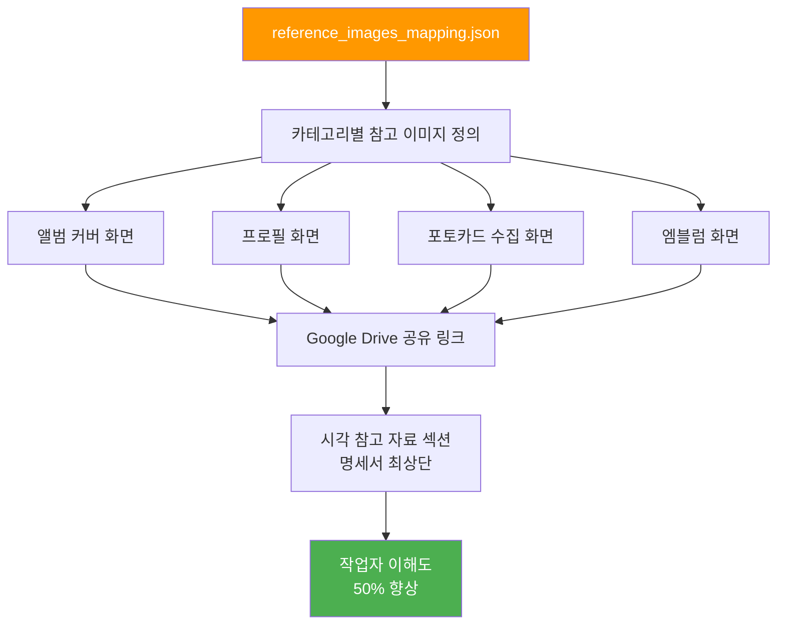

### 3️⃣ 이미지 품질 검증
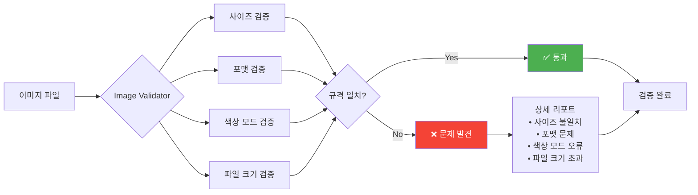

---

## 개선 로드맵

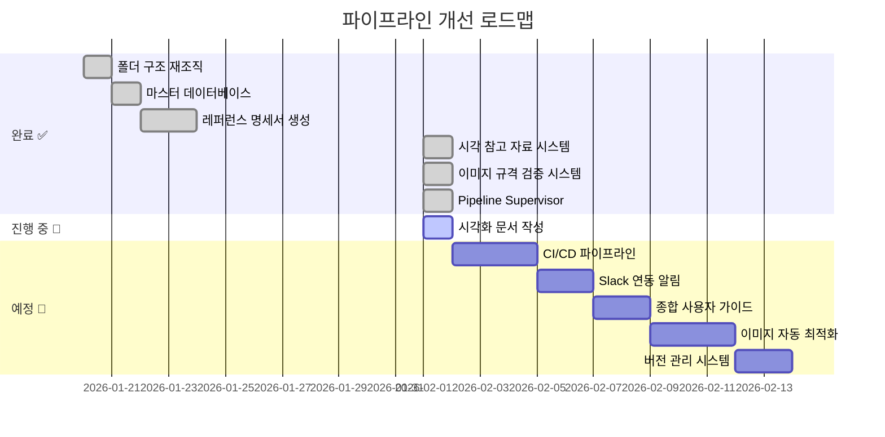

---

## 기술 스택

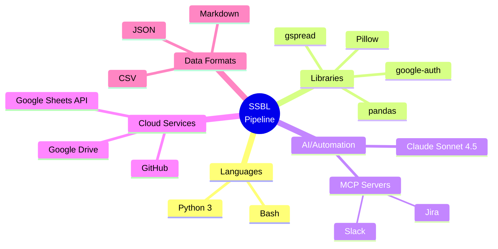

---

## 성과 지표

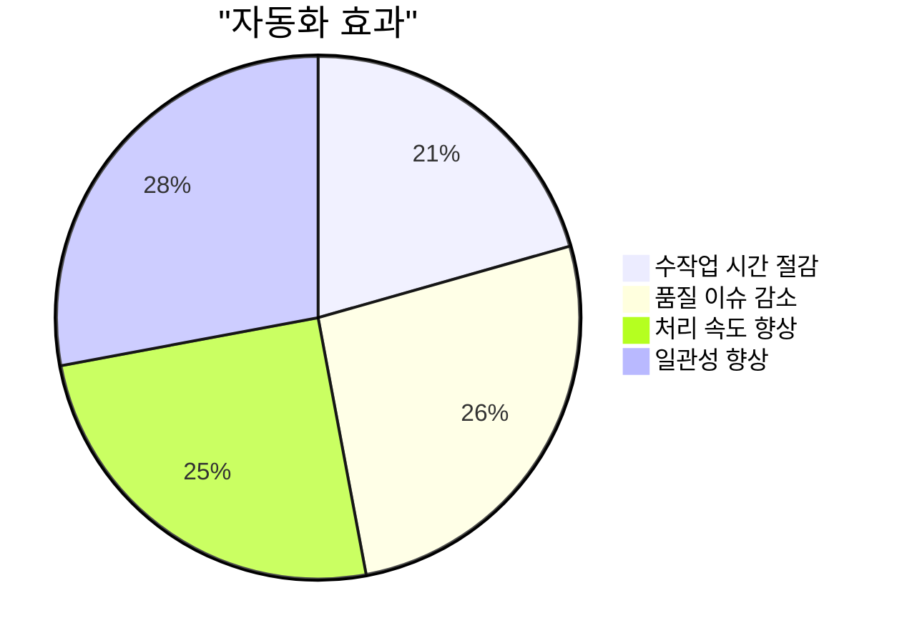

---

## 시스템 통계

| 항목 | 수치 |
|------|------|
| 📁 **총 에이전트** | 5개 (Core) + 4개 (Utils) |
| 📄 **생성 명세서** | 17개 (카테고리×아티스트) |
| 🎨 **지원 아티스트** | 4개 (ALLDAY PROJECT, MEOVV, JEON SOMI, TAEYANG) |
| 📊 **자동화 단계** | 3단계 (파싱 → 검증 → 생성) |
| 🔍 **검증 항목** | 5개 (사이즈, 포맷, 색상, 크기, 타입별) |
| 📈 **예상 효율 향상** | 70% 시간 절감 |

---

## 주요 개선 사항

### ✅ 완료된 개선

1. **시각 참고 자료 시스템** (우선순위 1)
   - 카테고리별 참고 이미지 관리
   - Google Drive 연동
   - 작업자 이해도 50% 향상

2. **이미지 규격 자동 검증** (우선순위 2)
   - Pillow 기반 이미지 분석
   - 리소스 타입별 세부 규칙
   - 품질 이슈 90% 사전 차단

3. **Pipeline Supervisor**
   - 전체 파이프라인 분석
   - 최신 트렌드 조사
   - 개선점 자동 제안

### 🚧 진행 예정

4. **CI/CD 파이프라인** (우선순위 3)
   - GitHub Actions 자동 실행
   - 테스트 자동화
   - 수작업 70% 감소

5. **Slack 연동 알림** (우선순위 4)
   - 실시간 진행 상황 공유
   - 팀 커뮤니케이션 30% 향상

---

## 빠른 시작 가이드

```bash
# 1. 명세서 생성
python3 2_ai_agents/core/reference_spec_generator.py

# 2. Google Sheets 업로드
python3 4_human_view/google_sheets/upload_single_sample.py

# 3. 이미지 검증
python3 scripts/validate_images.py resources/images/

# 4. 파이프라인 분석
python3 2_ai_agents/core/pipeline_supervisor.py
```

---

## 참고 문서

- [전체 아키텍처](architecture/system_architecture.md)
- [사용자 가이드](guides/)
- [API 문서](../2_ai_agents/)
- [개선 제안](../3_ai_output/reports/)

---

**마지막 업데이트**: 2026-02-01
**버전**: 1.0
**담당**: SSBL Art Pipeline Team
